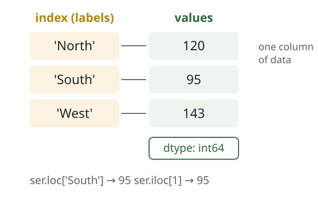

<!-- _class: title -->

# Pandas Series

4.1 · Think Data Science & Management

<!--
Welcome. Today is the first of the pandas lectures. By the end of class, students should be able to create a Series, explain what its index does, and pull values out of it by label, by position, and by condition.

Timing: about 50 minutes. Two quick checks and one practice exercise are built in.
-->

---

## Today's goals

- Explain what a **Series** is and why it has an **index**
- Create a Series from a list or a dictionary
- Recognize how pandas picks a **dtype**
- Select values with **`.loc`**, **`.iloc`**, and conditions
- Predict what happens when two Series are combined

<!--
Read the goals aloud. Tell students these five goals match the five parts of today's lecture and the exercises in section 4.1 of the book.

Point out that the last goal, combining Series, is where most beginners get surprised, so it is worth staying alert for.
-->

---

## Why labels matter

Business data is rarely "item number 0, 1, 2."

- Sales are by **region**, **product**, or **month**
- A label says *what* a number means
- Labels let pandas line up data from different sources

> A spreadsheet column with row names: that is a Series.

<!--
Start from what students know: spreadsheets. In a spreadsheet you find a value by its row name, not by counting rows. Pandas brings that idea into Python.

Ask: "If I give you the number 95, what does it mean?" Nothing without a label. "South region sales: 95" means something.

Transition: let's look at what a Series actually contains.
-->

---

## Anatomy of a Series



- **Index**: the labels
- **Values**: the data
- **dtype**: the type of every value

<!--
Walk through the diagram left to right. The index holds the labels North, South, West. The values hold the numbers. The dtype tells you what kind of values they are, here 64-bit integers.

Stress that the index is not just decoration. Every operation in pandas uses it: selecting, sorting, and combining.

The bottom line of the diagram previews two ways to get the same value: by label with loc, and by position with iloc. We come back to that in a few minutes.
-->

---

## Create a Series from a list

```python
import pandas as pd

sales = pd.Series([120, 95, 143],
                  index=['North', 'South', 'West'])
print(sales)
```

```output
North    120
South     95
West     143
dtype: int64
```

<!--
Live demo: type this in a notebook rather than reading it. Students learn more from watching it run.

Point at each line of the output: labels on the left, values on the right, dtype at the bottom.

Ask: "What happens if I leave out the index argument?" Then show the next slide.
-->

---

## No index? Pandas numbers the rows

```python
pd.Series([10, 20, 30])
```

```output
0    10
1    20
2    30
dtype: int64
```

> The default index is 0, 1, 2. It works, but it carries no meaning.

<!--
Without an index, pandas uses positions as labels. That is fine for quick work, but it throws away the main benefit of a Series.

Common student mistake: confusing these default labels with positions later on. Mention it now; we will see why it matters when we cover loc and iloc.
-->

---

## Create a Series from a dictionary

```python
sales = pd.Series({'North': 120, 'South': 95, 'West': 143})
```

- Dictionary **keys** become the index
- Dictionary **values** become the data
- Same result as the list version

<!--
This is the form most people use with real data, because the labels and values arrive together.

Connect to Python: students already know dictionaries map keys to values. A Series built from a dictionary keeps exactly that mapping, and adds pandas operations on top.
-->

---

<!-- _class: check -->

## Which call creates this Series?

```output
Q1    40
Q2    55
dtype: int64
```

1. `pd.Series([40, 55])`
2. `pd.Series({'Q1': 40, 'Q2': 55})`
3. `pd.Series(['Q1', 'Q2'], [40, 55])`
4. `pd.Series(40, 55)`

<!--
Give students 30 seconds, then poll with a show of hands or your classroom poll tool.

Answer: B. The dictionary keys become the labels Q1 and Q2.

Why the others are wrong: A has the default index 0 and 1. C puts the labels in as the data and the numbers as the index, the reverse of what we want. D is not a valid way to build this Series.
-->

---

## dtype: pandas picks one type

```python
pd.Series([1, 2, 3.5]).dtype      # float64
pd.Series([1, 'two', 3.0]).dtype  # object
```

- Mixed numbers become **float64**
- Text mixed with numbers becomes **object**
- `object` columns are slow and block math

<!--
Pandas stores each Series as one type. If you mix integers and a decimal, everything becomes a float. If you mix in text, you get object, which is pandas' catch-all.

Why managers should care: a sales column read from a messy spreadsheet often arrives as object because one cell says "n/a". Then sum and mean do not work the way you expect.
-->

---

## Fix the type with astype

```python
counts = pd.Series(['10', '20', '30'])   # text, not numbers
counts.astype(int).sum()
```

```output
60
```

> Check `dtype` first whenever math gives a strange answer.

<!--
Here the numbers arrived as text, which happens with CSV files all the time. astype converts the whole Series in one step.

Ask: "What would counts.sum() return before the conversion?" Answer: the strings joined together, '102030'. That is a good moment to show it live, because students remember the surprise.
-->

---

## Select by label or by position

<div class="cols">
<div class="col">

### By label: `.loc`

```python
sales.loc['South']
```

```output
95
```

</div>
<div class="col">

### By position: `.iloc`

```python
sales.iloc[1]
```

```output
95
```

</div>
</div>

<!--
Same value, two routes. loc uses the label you see in the index. iloc uses the position, counting from zero.

Rule of thumb for students: use loc when your labels mean something, which is most of the time with business data. Use iloc when you truly mean "the first one" or "the last three."
-->

---

## Slices: the end is different

<div class="cols">
<div class="col">

### `.loc` includes the end

```python
sales.loc['North':'South']
```

```output
North    120
South     95
dtype: int64
```

</div>
<div class="col">

### `.iloc` excludes the end

```python
sales.iloc[0:2]
```

```output
North    120
South     95
dtype: int64
```

</div>
</div>

<!--
This is the most common source of bugs with Series. A label slice includes its end label. A position slice stops before its end position, just like Python lists.

Both examples return the same two rows here, but for different reasons. Ask a student to explain why iloc[0:2] does not include West.
-->

---

## Filter with a condition

```python
sales[sales > 100]
```

```output
North    120
West     143
dtype: int64
```

- `sales > 100` gives True or False for every row
- Only the True rows are kept

<!--
Boolean indexing is how analysts ask questions of data: which regions beat 100? Which products are below target?

Show the inner expression on its own first, sales > 100, so students see the True and False values. Then show that wrapping it in brackets keeps the True rows.
-->

---

<!-- _class: check -->

## What does this return?

```python
sales.iloc[0:1]
```

1. Only North
2. North and South
3. An error
4. Only South

<!--
Give students 20 seconds.

Answer: A. iloc excludes the end position, so 0:1 returns just position 0, which is North.

If many students choose B, they are applying the loc rule. Revisit the previous slide for one minute before moving on.
-->

---

## Combining Series aligns on labels

```python
q1 = pd.Series({'North': 120, 'South': 95, 'West': 143})
q2 = pd.Series({'North': 130, 'South': 90, 'East': 60})
q1 + q2
```

```output
East       NaN
North    250.0
South    185.0
West       NaN
dtype: float64
```

<!--
Pandas matches rows by label, not by position. North adds to North and South adds to South. East and West appear in only one quarter, so pandas cannot add them and returns NaN, meaning missing.

Point out that the dtype changed to float64, because NaN is a float. This catches people off guard in reports.

Ask: "Is NaN the right answer for West?" It depends on the business question, which leads to the next slide.
-->

---

## Fill the gaps on purpose

```python
q1.add(q2, fill_value=0)
```

```output
East      60.0
North    250.0
South    185.0
West     143.0
dtype: float64
```

> Treating missing as zero is a **business decision**, not a coding default.

<!--
fill_value=0 tells pandas to treat a missing quarter as zero sales. That is right if the region truly sold nothing. It is wrong if the region simply had not reported yet.

This is a good discussion point for a management audience: the code is easy, the judgment is the hard part. Chapter 4's missing data section goes deeper.
-->

---

<!-- _class: yourturn -->

## City temperatures

```python
temps = pd.Series([72, 85, 68, 91, 77],
                  index=['NYC', 'Miami', 'Seattle', 'Phoenix', 'Denver'])
```

1. Get Miami's temperature with `.loc`
2. Get the first and last values with `.iloc`
3. List the cities above 75 degrees

<!--
Give students 5 minutes in pairs. This is the indexing exercise from section 4.1 of the book, so they can check the solution there afterward.

Walk the room and look for two common mistakes: using iloc with a city name, and forgetting the inner condition in step 3.

Answers: temps.loc['Miami'] is 85. temps.iloc[[0, -1]] gives NYC 72 and Denver 77. temps[temps > 75] gives Miami 85, Phoenix 91, Denver 77.
-->

---

<!-- _class: recap -->

## Recap

- A Series is **values plus an index**, with one **dtype**
- Build it from a **list** with `index=` or from a **dictionary**
- **`.loc`** uses labels and includes the end; **`.iloc`** uses positions and excludes it
- **Conditions** filter rows: `sales[sales > 100]`
- Math **aligns on labels**; missing matches become **NaN**

<!--
Summarize in your own words, or ask students to supply each line before you reveal it.

Next class: DataFrames, which are many Series sharing one index. Assign the section 4.1 exercises and the chapter Preview quiz before then.
-->
